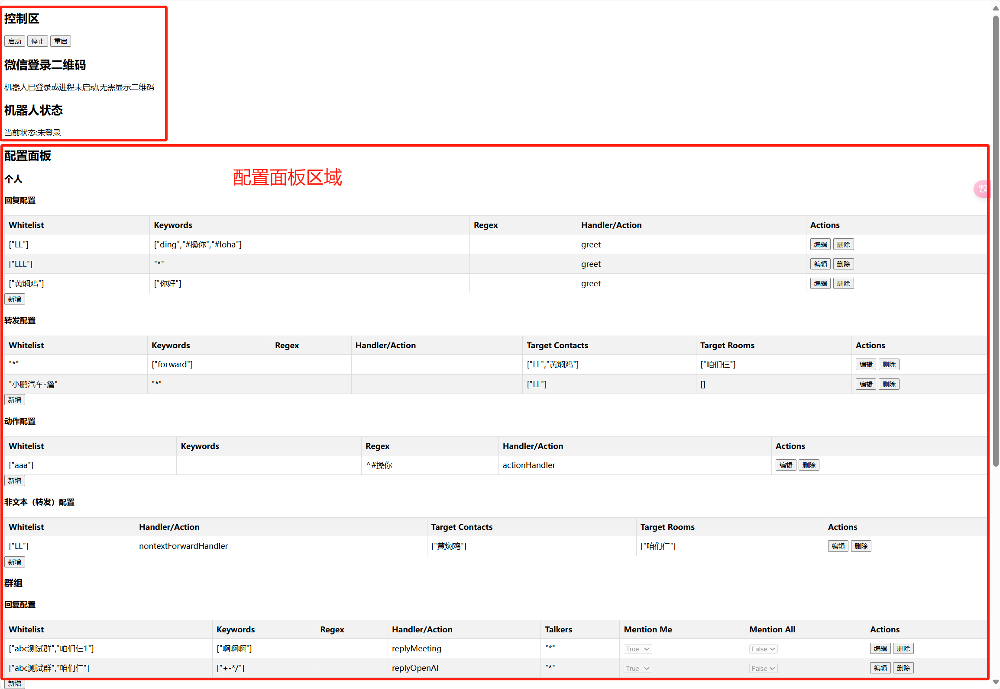
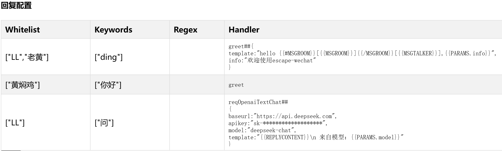
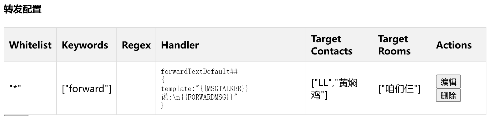
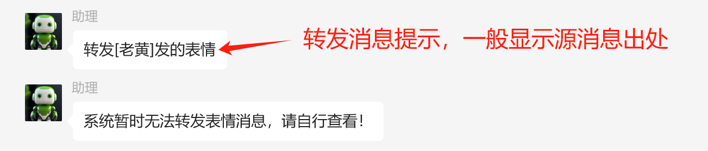
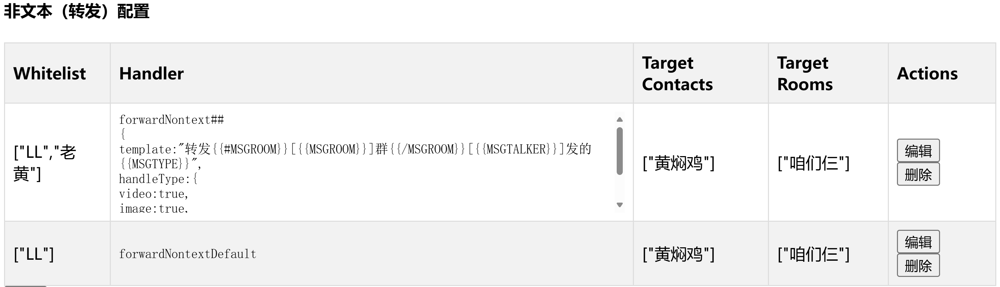
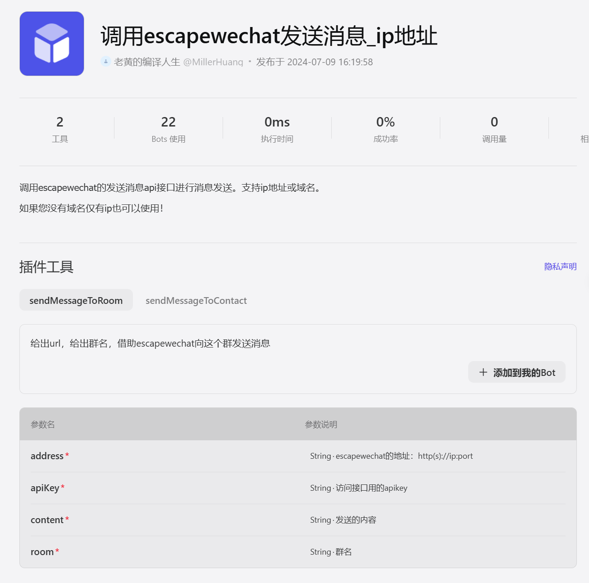

# ESCAPE-WECHAT 逃离微信
## 介绍：
escape-wechat是一个微信助手，通过简单的可视化的配置，实现微信好友、微信群的指定消息的**自动回复、自动转发或自动处理**，让你从微信中“逃”出来，拯救你宝贵的注意力。<br/>
**最新功能：** 提供发送消息的api接口供第三方应用调用，可发送群消息或个人消息。 <br/>

>
**为什要做这个东西？**<br/>
小故事：<br/>
我的孩子正在上小学，学校各项事务都会通过微信群进行发布，包括作业和各项通知。而群里家长也会进行提问和完成作业情况的打卡，群里核心信息密度不高。如果你需要了解群里的核心消息，你可能需要翻看很长时间的历史消息，这会消耗你的注意力。另外就是孩子的校车群，每天我需要关注的就是校车到达到某个特定站点的消息。在收到这个消息后，我出发去接孩子即可。可是校车老师会从发车起就开始发消息，并且伴随不少家长的提问。这会大大分散你的注意力，甚至会导致你无法及时关注你最应该关注的那条消息。<br>
于是我开发了这东西。<br/>

在实现上述功能后，我还把这个东西也对接上了大语言模型，只要api使用了openAI的api，你就可以经过简单的配置实现智能回复。<br>
本项目基于wechaty项目，感谢wechaty项目组提供的开源项目。<br>
<u>https://github.com/wechaty/wechaty</u>

**相关视频介绍**

整体介绍：<u>https://www.bilibili.com/video/BV1rChKedEEU/?share_source=copy_web&vd_source=579e78efb0216f2f28668ffcc498291d</u><br>
云部署介绍：<u>https://www.bilibili.com/video/BV1yMhWeCEJX/?share_source=copy_web&vd_source=579e78efb0216f2f28668ffcc498291d</u><br>
api调用：<u>https://www.bilibili.com/video/BV1PiaYegEuC/?share_source=copy_web&vd_source=579e78efb0216f2f28668ffcc498291d</u><br>
对接大模型：<u>https://www.bilibili.com/video/BV1x98JeeEGa/?share_source=copy_web&vd_source=579e78efb0216f2f28668ffcc498291d</u><br>
<br/>

## 如何安装：
一、使用docker安装<br>
docker安装是最简单，最快捷的方案
1. 拉取镜像
```shell
docker pull hmllsnow/escape-wechat
```
如果你的网络环境访问不到dockerhub，可以使用华为云镜像仓库拉取
```shell
docker pull swr.cn-north-4.myhuaweicloud.com/hmllsnow/escape-wechat:latest
```
2. 运行容器
```shell
docker run -d -p 443:443 -p 8080:8080  -e API_KEY="your api key" -e LOGIN_PWD="your_login password use fro login control Panel" --name escape-wechat-container hmllsnow/escape-wechat
```
> API_KEY参数配置使用api接口发送消息时的apikey <br>
LOGIN_PWD参数配置登录配置页面的密码 <br>

二、node直接运行
如果您是开发者，可以使用nodejs直接运行。不建议普通用户使用nodejs直接运行本项目，你要解决的问题远多于docker启动：nodejs安装，git安装，git访问github，node依赖的安装，等等。但是如果你做好准备了，那就开始吧。安装好后，你甚至可以尝试自己开发一些处理函数来处理消息。很简单且很有趣。
1. 安装nodejs<br/>
<u>https://nodejs.org/zh-cn/download/prebuilt-installer</u><br/>
<u>https://nodejs.cn/download/</u><br/>
检查是否成功安装了nodejs和npm
```shell
node -v
```
```shell
npm -v
```
2. 安装git<br/>
<u>https://git-scm.com/downloads</u><br/>
检查git是否安装成功
```shell
git -v
```
3. 使用git克隆本项目
在你希望存放本项目的目录下，执行以下命令克隆本项目
```shell
git clone https://github.com/hmllsnow/escape-wechat.git
```
4. 安装依赖
进入escape-wechat目录下，进入background，bot，frontground目录下执行以下命令安装依赖
```shell
npm install
```

5. 运行
进入escape-wechat目录下，进入background
```shell
node index.js
```
进入escape-wechat目录下，进入frontground目录
```shell
npm start
```
6. 访问控制面板
<u>http://localhost:7788</u>


## 如何升级：
**为什么升级：**
功能还在不停完善，bug也在不停修复，所以升级技巧也是需要的。<br>
**docker版升级原理：**
删除原docker镜像，拉取新版镜像<br>
**升级好处：**
使用新功能<br>
**升级坏处：**
原配置都丢了，所以请把你的配置都备份好（目前我能给你的备份方法就是，复制粘贴进写字版，安装好新版后再配置一遍）<br>

**好了，现在就告诉你指令：**
>
1、强制把容器干掉
```shell
docker rm -f escape-wechat-container
```
2、删除镜像
```shell
docker rmi hmllsnow/escape-wechat
```
3、拉取、运行新的容器
```shell
docker run -d -p 443:443 -p 8080:8080  -e API_KEY="your api key" -e LOGIN_PWD="your_login password use fro login control Panel" --name escape-wechat-container hmllsnow/escape-wechat
```
4、登陆配置页面，重新配置，并登陆机器人


## 如何使用：
**2024.7.28 新版本升级：** </br>
增加了handler字段的参数配置功能，在配置是可以更加灵活的传入参数。</br>
**举例说明：** </br>
对接openAI api时，我们需要由apikey，模型名，baseurl等参数。初期版本，我们在docker run 命令中传入参数，但是随着参数的增多，docker run 命令的参数会变得非常长。另外，同样的格式的接口（openai格式），当你需要对接不同厂商的大模型时，通过docker run 命令只能传入一套参数。</br>
因此，我们增加了handler字段的参数配置功能，在配置是可以更加灵活的传入参数。</br>

**handler字段格式：**
```shell
函数名##{JSON格式参数}
```
### 一、进入配置页面
核心功能都在配置页面完成。根据你的安装方法，进入配置页面略有不同<br/>
#### 1、docker安装
如果使用docker镜像方式运行，配置页面：<u>[http://localhost:8080](http://localhost:8080)</u> <br/>
#### 2、node直接运行
不适用docker，且没有修改配置文件，配置页面：<u>[http://localhost:7788](http://localhost:7788)</u> <br/>
### 二、配置
配置页面分为二个部分：<br/>


#### 1、控制区
首先是：启动，停止，重启按钮
启动：启动微信机器人，如果已经启动，则不会重复启动。
停止：停止微信机器人，如果已经停止，则不会重复停止。
重启：重启微信机器人（修改配置后请重启生效）

#### 2、配置面板
大类分为个人和群，分别对应个人微信消息、群消息的配置
##### 1、个人消息
###### 1.1、回复配置
收到白名单（*表示任何人）用户发送的文本消息，如何文本消息包含Keyword关键字（或文本消息符合Regex配置的正则表达）则执行Handler配置的回复函数。默认已经开发了greet函数，具体使用方法见下文的举例。<br>
注意：keyword、regex 兩個條件可以同時存在，但必須同時符合，才会触发，所以這樣做意義不大，所以建議這兩個條件互斥存在。<br/>
**bug** <br/>
白名单配置联系人的时候，应该配置其昵称，但目前wechaty的免费puppet存在bug，有时会将你配置的备注名识别为联系人的昵称，所以如果联系人配置有备注名，建议白名单将其昵称和备注名都配置进去。<br>

**举例：**<br/>
***greet***<br/>
**greet回复函数实现了调用函数传参的功能，函数名和参数之间通过\#\#分隔，参数使用json格式**<br/>
greet函数参数：
template：回复模板。定义函数收到消息后的回复消息的模板。
模板{{参数名}}的方式，置入变量。构建temmplate时，我们内置的变量名有：<br/>
>**MSGROOM** 源消息群名，如果非群消息，则取值为空。{{#MSGROOM}}[{{MSGROOM}}]{{/MSGROOM}}表示，MSGROOM不为空，显示群名称，为空则不显示。<br/>
**MSGTALKER** 源消息发消息的人的昵称（别名）<br/>
**PARAMS** 代表本参数配置<br/>
```shell
greet##{
template:"hello {{#MSGROOM}}[{{MSGROOM}}]{{/MSGROOM}}[{{MSGTALKER}}],{{PARAMS.info}}",
info:"欢迎使用escape-wechat"
}
#收到后的回复内容：hello [群聊（如发自群）][小明],欢迎使用escape-wechat
```


***reqOpenaiTextChat***<br/>
reqOpenaiTextChat函数参数：<br/>
template（非必输）：回复模板。自定义回复消息的模板。<br/>
不输入默认回复格式为： 大模型回复内容 （换行） from 模型名称<br/>
模板{{参数名}}的方式，置入变量。构建temmplate时，我们内置的变量名有：<br/>

>**REPLYCONTENT** 大模型（比如openai）的回复消息内容。<br/>
**MSGROOM** 源消息群名，如果非群消息，则取值为空。{{#MSGROOM}}[{{MSGROOM}}]{{/MSGROOM}}表示，MSGROOM不为空，显示群名称，为空则不显示。<br/>
**MSGTALKER** 源消息发消息的人的昵称（别名）<br/>
**PARAMS** 代表本参数配置<br/>


```shell
reqOpenaiTextChat##
{
baseurl:"https://api.deepseek.com",
apikey:"sk-********************",
model:"deepseek-chat",
template:"{{REPLYCONTENT}}\n 来自模型：{{PARAMS.model}}"
}
```
--说明：1、baseurl：大模型api地址，2、apikey：大模型api key，3、model：大模型模型名称<br/>
举例使用的deepseek模型（原因：接口格式与openai一致且价格较低）<br/>


###### 1.2、转发配置
收到白名单（*表示任何人）用户发送的文本消息，如何文本消息包含Keyword关键字（或文本消息符合Regex配置的正则表达）则转发到指定的群Target Rooms或联系人Target Contacts。

**举例：**<br/>
***forwardTextDefault***<br/>
forwardTextDefault函数参数：
template（非必输）：转发模板。定义函数收到消息后的转发消息的模板。<br/>
不输入默认转发格式为： 转发[群名][好友名]的消息：（换行）消息内容 <br/>
模板{{参数名}}的方式，置入变量。构建temmplate时，我们内置的变量名有：<br/>

>**FORWARDMSG** 待转发文本消息内容<br/>
**MSGROOM** 源消息群名，如果非群消息，则取值为空。{{#MSGROOM}}[{{MSGROOM}}]{{/MSGROOM}}表示，MSGROOM不为空，显示群名称，为空则不显示。<br/>
**MSGTALKER** 源消息发消息的人的昵称（别名）<br/>
**PARAMS** 代表本参数配置<br/>
```shell
forwardTextDefault##
{
template:"{{MSGTALKER}}说:\n{{FORWARDMSG}}"
}
```


###### 1.3、动作配置
收到白名单（*表示任何人）用户发送的文本消息，如何文本消息包含Keyword关键字（或文本消息符合Regex配置的正则表达）则执行Handler配置的函数内写好的动作。<br/>
**回复函数实现了调用函数传参的功能，函数名和参数之间通过\#\#分隔，参数使用json格式**<br/>
**举例：**<br/>
***reqCozeTextChat***<br/>
对接coze平台的api接口
reqCozeTextChat函数参数：
>apikey 对接coze api接口的apikey<br/>
bot_id coze中建立的智能体id<br/>
user_id 用户id，可以自由上传<br/>

```shell
reqCozeTextChat##
{
apikey:"pat_***************", bot_id:"123456789123456789", user_id:"***" }
```

***sayRoomMembers***<br/>
返回群成员列表
暂无输入参数


###### 1.4、非文本消息处理配置
由于非文本消息目前不能处理，所以非文本消息一般执行转发规则。收到白名单人员发送的消息，直接转发给指定群或指定群。
**举例：**<br/>
***forwardNontextDefault***<br/>
非文本类消息默认转发方法：转发到指定联系人或群<br/>
可以处理**图片、视频、文件**格式的转发<br/>
转发的数据分为两条：<br/>
第一条描述源消息的出处，第二条为实际内容<br/>
如非文本消息为无法处理消息，则转发无法处理的提示。
<br/>
***forwardNontext***<br/>
非文本类消息转发方法，转发非文本消息到指定联系人或群<br/>
forwardNontext函数参数：<br/>
handleType：配置转发消息的类型。分为video，image，file，other（以上三种以外）。当other类型本身无法转发，配置为true时，会转发提示：消息无法转发处理。<br/>
>video:true/false 是否转发视频<br/>
image:true/false 是否转发图片<br/>
file:true/false 是否转发文件<br/>
other:true/false 是否转发以上三种以外的其他消息<br/>

template：转发模板。用于定义源消息出处的提示文本消息格式。如不配置则无提示。<br/>
模板{{参数名}}的方式，置入变量。构建temmplate时，我们内置的变量名有：<br/>

>**MSGTYPE** 待转发消息类型<br/>
**MSGROOM** 源消息群名，如果非群消息，则取值为空。{{#MSGROOM}}[{{MSGROOM}}]{{/MSGROOM}}表示，MSGROOM不为空，显示群名称，为空则不显示。<br/>
**MSGTALKER** 源消息发消息的人的昵称（别名）<br/>
**PARAMS** 代表本参数配置<br/>



```shell
forwardNontext##
{
template:"转发{{#MSGROOM}}[{{MSGROOM}}]群{{/MSGROOM}}[{{MSGTALKER}}]发的{{MSGTYPE}}",
handleType:{
video:true,
image:true,
file:false,
other:true
}}
```



##### 2、群消息
回复，转发、动作与个人消息规则类似，增加了说话人（就是消息的发送人），增加了@自己和@所有人两个选项。
规则说明：当群白名单，说话人满足后。执行后续规则————。所以如果想要仅在被@时触发，就要配置一个永远无法满足的keyword做为条件。


## API调用

可以使用api调用，是程序开放与否的重要衡量。为了让您体验开放带来的快感，我也设计了两个api接口。可以实现调用api接口发送消息（两个接口分别对应群和个人消息）。
#### 接口地址
```shell
https://ip:443/api/
```
#### 接口文档
接口必须携带参数apiKey，apikey为docker run 启动容器时API_KEY配置的参数
##### 1、发送群消息
Method: POST<br/>
/chat/room<br/>
<br/>
**总体结构**

| 参数名      | 必填 | 类型   | 说明                                                     | 默认值 |
|-------------|------|--------|-----------------------------------------------------------|--------|
| apiKey      | 是   | string | apiKey                                                    | 无     |
| roomName    | 是   | string | 群名                                                     | 无     |
| message     | 是   | object | 消息内容，数据格式参考message数据类型说明              | {}     |
   
**message字段结构**

| 参数名       | 必填 | 类型   | 说明                                    | 默认值 |
|----------------|------|--------|------------------------------------------|--------|
| type           | 是   | number | 消息类型：1 文字 2 图片url 3 图片base64 (暂时仅支持1) | 1      |
| content        | 否   | string | 消息内容，如果type为1必填，内容换行使用\n               | 无     |
| url            | 否   | string | type 为2，3必填，图片地址，或者文件地址，例如png,jpg或者zip，excel都可以，必须是网络地址(暂时不支持) | 无 |
##### 2、发送群消息
Method: POST<br/>
/chat/contact<br/>
<br/>
**总体结构**

| 参数名   | 必填 | 类型   | 说明                                    | 默认值 |
|----------|------|--------|------------------------------------------|--------|
| apiKey   | 是   | string | apiKey                                   | 无     |
| name     | 是   | string | 好友昵称，不能带特殊字符和表情           | 无     |
| alias    | 否   | string | 好友备注，如果昵称带特殊字符，建议使用备注，name为空，alias有值即可 | 无     |
| wxid     | 是   | string | 好友列表查看wxid 对于web协议此id 不唯一，可能不生效（插件>1.6.10支持） | 无    |
| message  | 是   | object | 消息内容，数据格式参考message数据类型说明  | {}     | 

**message字段结构**

| 参数名       | 必填 | 类型   | 说明                                    | 默认值 |
|----------------|------|--------|------------------------------------------|--------|
| type           | 是   | number | 消息类型：1 文字 2 图片url 3 图片base64 (暂时仅支持1) | 1      |
| content        | 否   | string | 消息内容，如果type为1必填，内容换行使用\n               | 无     |
| url            | 否   | string | type 为2，3必填，图片地址，或者文件地址，例如png,jpg或者zip，excel都可以，必须是网络地址(暂时不支持) | 无 |

##### 3、请求示例
```shell
curl -k --location 'https://127.0.0.1/api/chat/contact' \
--header 'Content-Type: application/json' \
--data '{
    "apiKey": "your apikey",
    "name": "联系人",
    "alias":"",
    "message": {
        "type": 1,
        "content":"消息内容"
    }
    
}'
```
```shell
curl -k --location 'https://127.0.0.1/api/chat/room' \
--header 'Content-Type: application/json' \
--data '{
    "apiKey": "your apikey",
    "roomName":"群名",
    "message": {
        "type": 1,
        "content":"群消息"
    }
    
}'
```
windows cmd 请求示例（注意不是power shell）
```command prompt
curl -k -X POST "https://127.0.0.1/api/chat/contact" ^
-H "Content-Type: application/json" ^
-d "{\"apiKey\": \"your apikey\", \"name\": \"联系人\", \"alias\": \"\", \"message\": {\"type\": 1, \"content\": \"消息内容\"}}"
```
```command prompt
curl -k -X POST "https://127.0.0.1/api/chat/room" ^
-H "Content-Type: application/json" ^
-d "{\"apiKey\": \"your apikey\", \"roomName\": \"群名\",\"message\": {\"type\": 1, \"content\": \"消息内容\"}}"
```
**加入 `-k` 参数忽略自签名证书，否则会报错。咱们的程序暂时使用的是自签名证书，所以需要忽略。**

## 外部应用
### COZE插件
已在COZE插件中实现调用api接口发送消息的功能。<br>

